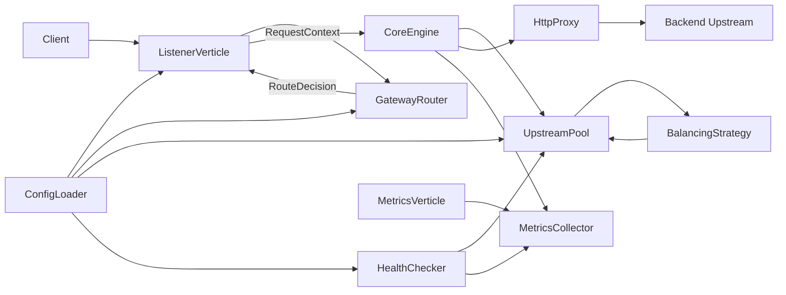
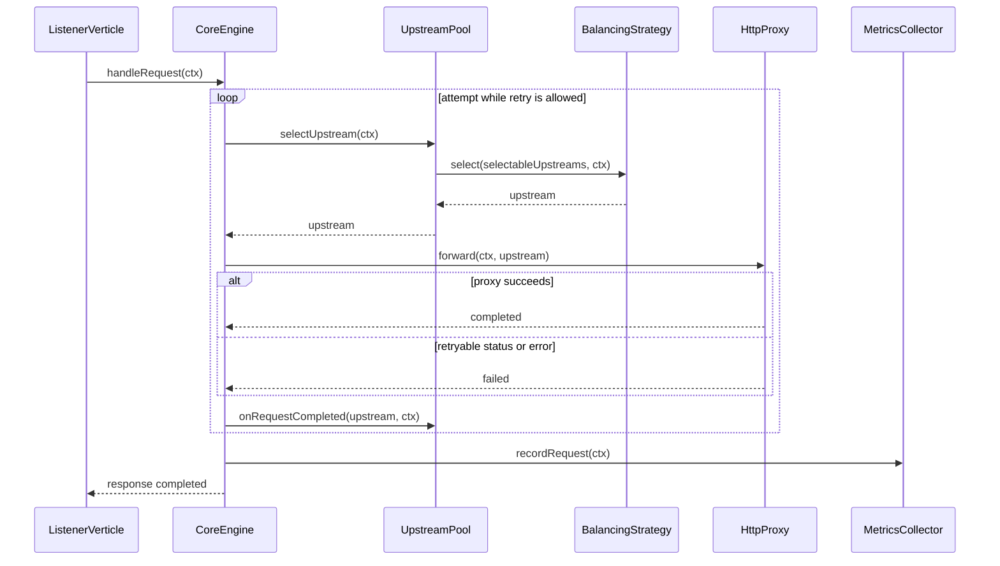

# VertiLB

[](#)
[](#)
[](#)
[](https://github.com/tishiu/VertLB)

VertiLB is a Java 21 / Vert.x API gateway and load balancer. It routes inbound HTTP requests to backend service pools, selects upstreams with pluggable balancing strategies, proxies traffic without blocking the event loop, tracks health, and exposes runtime metrics.

Repository: [github.com/tishiu/VertLB](https://github.com/tishiu/VertLB)

## What It Does

- routes requests by host, method, and path prefix
- rewrites outbound paths before proxying
- balances traffic with round-robin, random, IP-hash, or least-connections strategies
- filters unhealthy upstreams out of selection
- retries safe requests on retryable gateway failures
- exposes JSON metrics for requests, latency, errors, upstreams, and pool health

## Architecture



## Boundaries

- `ListenerVerticle` owns the inbound HTTP server and turns requests into `RequestContext`.
- `GatewayRouter` owns route matching, host/method/path checks, and URI rewriting.
- `CoreEngine` owns request orchestration: pool lookup, upstream selection, proxy forwarding, retry decisions, logging, and metrics.
- `UpstreamPool` owns runtime upstream state and filters selectable upstreams before delegating to a strategy.
- `BalancingStrategy` chooses one upstream from the already-filtered list.
- `HttpProxy` owns outbound HTTP forwarding and response piping.
- `HealthChecker` probes upstreams and updates pool health state.
- `MetricsCollector` stores in-memory request, latency, error, upstream, and pool-health metrics.
- `MetricsVerticle` exposes the metrics snapshot over HTTP.

The key boundary is that routing, pool selection, proxying, health checks, and metrics stay separate. `CoreEngine` coordinates the request path without owning those internals.

## CoreEngine Flow



`CoreEngine` retries only safe methods when the failure is retryable. Retryable upstream statuses are `502`, `503`, and `504`. If no selectable upstream exists, the request is completed as a gateway failure instead of reaching the proxy.

## Config Model

VertiLB is configured around listeners, routes, pools, upstreams, health checks, retry settings, logging, and metrics.

- listeners define where VertiLB accepts traffic
- routes decide which pool receives a request
- pools group upstream instances and define the balancing strategy
- health checks update whether an upstream remains selectable

## Run Locally

```bash
./gradlew clean test
./scripts/smoke-gateway.sh
```

The smoke script starts mock backends, starts VertiLB, checks routed traffic, verifies retryable upstream status handling, and reads the metrics endpoint.
